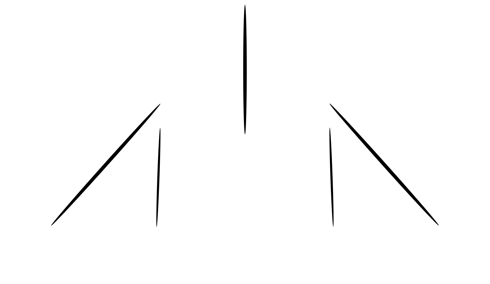

# Kurai Project

<div align = center>


<br><br><br>

&ensp;[<kbd> <br> Install <br> </kbd>](#installation)&ensp;
&ensp;[<kbd> <br> Development <br> </kbd>](#development)&ensp;
<br><br></div>

## Introduction

Kurai Project is an open source fan-game set in world of [Touhou Project](https://en.wikipedia.org/wiki/Touhou_Project).
It is top-down vertical-scrolling curtain of fire shooting game (STG) also known as "Bullet hell" or "Danmaku".
STGs are fast-paced games focused around pattern recognition and mastery through practice.

Kurai Project is somewhat portable, and it's written in Rust, 
the portability comes from [macroquad](https://github.com/not-fl3/macroquad) crate for handling file and rendering, 
it support OpenGL, Metal, GLES rendering and also WebGL for browser such as Firefox and Chromium based browser, 
it can be compiled for number of operating system.

### About Touhou Project

Touhou Project is an indie game series (also known as "doujin" in Japanese)
known for its ensemble cast of characters and memorable soundtracks.
It is produced by and large by a single artist known as ZUN, and has a
[permissive license](https://en.touhouwiki.net/wiki/Touhou_Wiki:Copyrights#Copyright_status.2FTerms_of_Use_of_the_Touhou_Project>)
which allows for indie derivative works such as Kurai Project to legally exist.

Kurai Project is *not* a "clone" of Touhou Project, and tells an original story with its own
music, art, gameplay mechanics, and codebase. While some familiarity with Touhou
is helpful, the gameplay can be enjoyed on its own without prior knowledge of
the series.

For more information on dōjin culture,
[click here](https://en.wikipedia.org/wiki/D%C5%8Djin).

## Installation

### System Requirement

----------------------------------------
| Component |   Minimum  | Recommended |
|-----------|------------|-------------|
|    CPU    |   2.0 Ghz  |   2.0 Ghz   |
|    RAM    |   300 Mb   |   500 Mb    |
|    GPU    |    1 Gb    |  > 1.0 Gb   |

* The requirement might change over the course of development

> [!WARNING]
> Pre-compiled is not yet available, you can install it via cargo install or cargo build``

## Development

Make sure you already installed Rust at minimum 1.75 because I might be using latest Rust feature

```sh
# Clone repository and enter to cloned directory
git clone https://github.com/UnknownRori/scarlet-project
cd scarlet-project

# Run the game
cargo run
```
